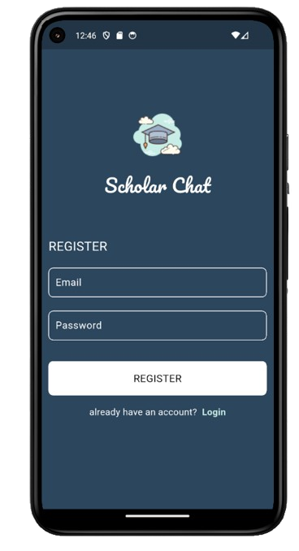
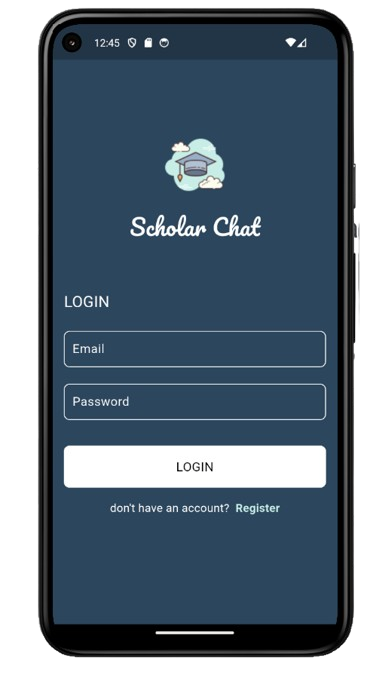
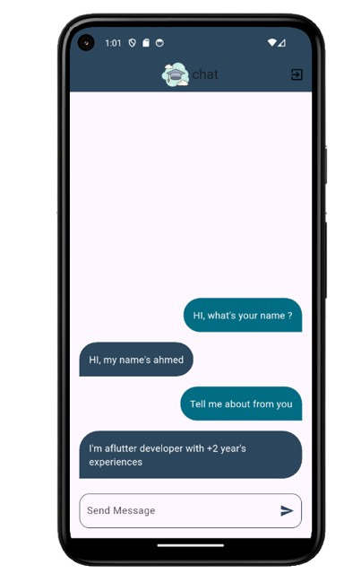

# 💬 simple_chat_app

Flutter chat app with clean UI and Firebase authentication.

------------

## 🎬 Preview

- Register Page → Login Page → Chat Page  

-----------

## 📸 Screenshots

| Register Page | Login Page |
|---------------|------------|
|  |  |

| Chat Page |
|-----------|
|  |

---

## ✅ Features

- (Register Page) → Create a new account with Firebase  
- (Login Page) → Secure login with validation  
- (Chat Page) → Real-time messaging with clean design  
- Responsive UI using **MediaQuery**  
- State management with **MVVM + Bloc & Cubit**  

---

## 🧠 Architecture

- ✅ MVVM Pattern (Model, View, ViewModel)  
- 🧠 Bloc & Cubit for State Management (flutter_bloc)  
- 🔐 FirebaseAuth for authentication  
- 🎨 MediaQuery for Responsive UI  

---

## 🚀 Get Started

```bash
git clone https://github.com/AhmedMohamed195/Chat_app_1/edit/master/README.md
cd chat_app_1
flutter pub get
flutter run
